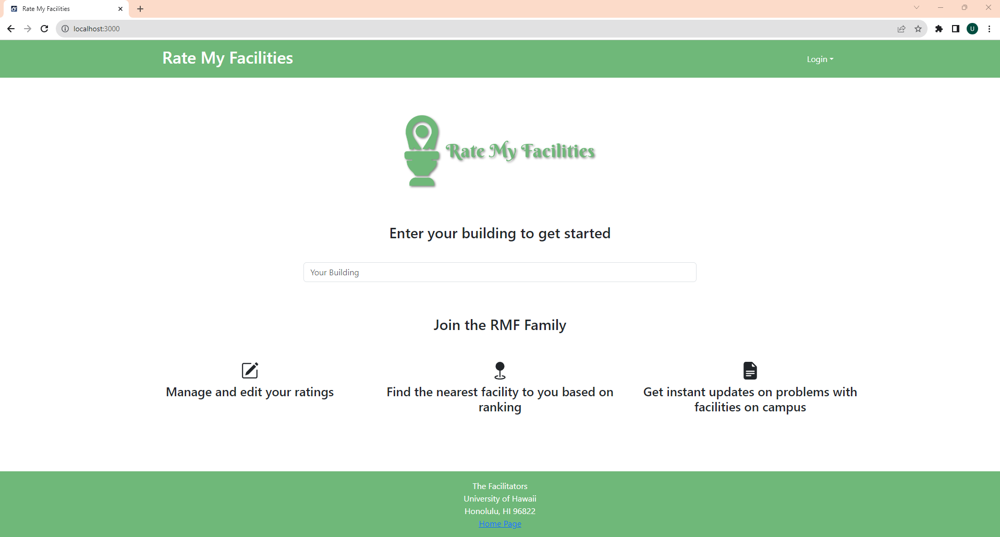

# **Rate My Facilities**

### Table of Contents
- <a href="overview">Overview</a>
- <a href="team">Team</a>
- <a href="deployment">Deployment</a>

<h2 id="overview">
Overview</h2>

Many people on campus struggle with finding facilities they are satisfied with. Well-known restrooms tend to become crowded and will sometimes run out of resources like toilet paper and soap. Water fountain filters are sometimes left unchanged for too long and will become contaminated. Popular study spaces can also become overcrowded and loud, while many "secret" spots are not utilized. Our project, Rate My Facilities, will be a resource that students can use to find facilities near them, rate their quality, and post comments about them.

<h2 id="team">
Team</h2>

<a href="https://docs.google.com/document/d/1ddkkbSHYJAy0VHQvVl842vhn9q4RlY688vB10F-lX9o/edit?usp=sharing">Team Contract</a>

- <a href="https://silviadebenedictis.github.io/">Silvia De Benedictis</a> - Silvia is a Computer Science student expecting to graduate in Fall 2024. Her interests are in Programming, Web Design, Artificial Intelligence, and Graphic Design.
- <a href="https://jgaleria.github.io/">Joshua Galeria</a> - Joshua is a Computer Engineering student expecting to graduate in Spring 2024. His interests are in Software Engineering, Robotics, Computer Vision, and Machine Learning.
- <a href="https://uhalpern.github.io/">Urban Halpern</a> - Urban is a Computer Science student expecting to graduate in Fall 2024. His interests are in Data Science, Machine Learning, Programming, and Game Development.
- <a href="https://kimsyd.github.io/">Sydney Kim</a> - Sydney is a Computer Science student expecting to graduate in Fall 2024. Her interests are in STEM Education, Sustainability Technologies, User Experience Design, and Graphic Design.
- <a href="https://tranw8.github.io/">Wilson Tran</a> - Wilson is a Computer Science student expecting to graduate in Fall 2024. His interests are in Cybersecurity, Linux Kernel Development, and Language Learning.

<h2 id="deployment">
Deployment</h2>

### Landing Page

This landing page is displayed upon running the site before the user logs in.

### User Homepage
### Facility Ranking
### Individual Facilities
### Complaints

### Project Pages

<a href="m1.md">M1 Project Page</a>
