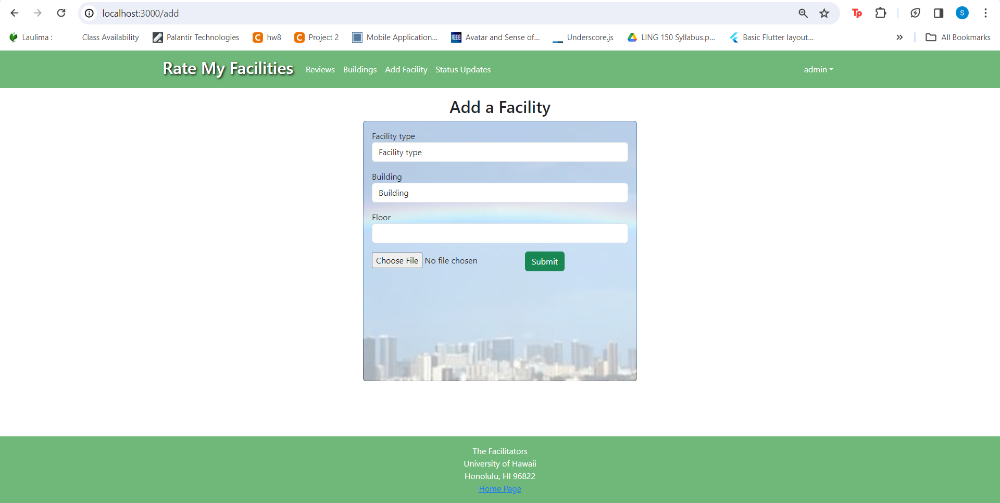

### Table of Contents
- <a href="#overview">Overview</a>
- <a href="#team">Team</a>
- <a href="#installation">Installation</a>
- <a href="#deployment">Deployment</a>
- <a href="#feedback">Community Feedback</a>

<h2 id="overview">
Overview</h2>

Many people on campus struggle with finding facilities they are satisfied with. Well-known restrooms tend to become crowded and will sometimes run out of resources like toilet paper and soap. Water fountain filters are sometimes left unchanged for too long and will become contaminated. Popular study spaces can also become overcrowded and loud, while many "secret" spots are not utilized. Our project, Rate My Facilities, will be a resource that students can use to find facilities near them, rate their quality, and post comments about them.

<h2 id="team">
Team</h2>

<a href="https://docs.google.com/document/d/1ddkkbSHYJAy0VHQvVl842vhn9q4RlY688vB10F-lX9o/edit?usp=sharing">Team Contract</a>

- <a href="https://silviadebenedictis.github.io/">Silvia De Benedictis</a> - Silvia is a Computer Science student expecting to graduate in Fall 2024. Her interests are in Programming, Web Design, Artificial Intelligence, and Graphic Design.
- <a href="https://jgaleria.github.io/">Joshua Galeria</a> - Joshua is a Computer Engineering student expecting to graduate in Spring 2024. His interests are in Software Engineering, Robotics, Computer Vision, and Machine Learning.
- <a href="https://uhalpern.github.io/">Urban Halpern</a> - Urban is a Computer Science student expecting to graduate in Fall 2024. His interests are in Data Science, Machine Learning, Programming, and Game Development.
- <a href="https://kimsyd.github.io/">Sydney Kim</a> - Sydney is a Computer Science student expecting to graduate in Fall 2024. Her interests are in STEM Education, Sustainability Technologies, User Experience Design, and Graphic Design.
- <a href="https://tranw8.github.io/">Wilson Tran</a> - Wilson is a Computer Science student expecting to graduate in Fall 2024. His interests are in Cybersecurity, Linux Kernel Development, and Language Learning.

<h2 id="deployment">
Deployment</h2>
<a href="https://ratemyfacilities.me/">Deployed application running on Digital Ocean</a>

<h2 id="installation">
## Installation

First, [install Meteor](https://www.meteor.com/install).

Second, go to [https://github.com/d-facilitators/rate-my-facilities](https://github.com/d-facilitators/rate-my-facilities), and click the "Use this template" button. Complete the dialog box to create a new repository that you own that is initialized with this template's files.

Third, go to your newly created repository, and click the "Clone or download" button to download your new GitHub repo to your local file system.  Using [GitHub Desktop](https://desktop.github.com/) is a great choice if you use MacOS or Windows.

Fourth, cd into the app/ directory of your local copy of the repo, and install third party libraries with:

```
$ meteor npm install
```

## Running the system

Once the libraries are installed, you can run the application by invoking the "start" script in the [package.json file](https://github.com/ics-software-engineering/meteor-application-template-react/blob/master/app/package.json):

```
$ meteor npm run start
```
The first time you run the app, it will create some default users and data. Here is the output:

```
 meteor npm run start
> meteor-application-template-react@ start C:\Users\ICS314\rate-my-facilities\app
> meteor --no-release-check --exclude-archs web.browser.legacy,web.cordova --settings ../config/settings.development.json

[[[[[ C:\Users\ICS314\rate-my-facilities\app ]]]]]

=> Started proxy.
=> Started HMR server.                        
=> Started MongoDB.                           
I20231128-12:36:00.875(-10)? Creating the default user(s)
I20231128-12:36:00.903(-10)?   Creating user admin.
I20231128-12:36:01.229(-10)?   Creating user johnfoo.
=> Started your app.

=> App running at: http://localhost:3000/

```

### Viewing the running app

If all goes well, the template application will appear at [http://localhost:3000](http://localhost:3000).  You can login using the credentials in [settings.development.json](https://github.com/ics-software-engineering/meteor-application-template-react/blob/main/config/settings.development.json), or else register a new account.

### ESLint

You can verify that the code obeys our coding standards by running ESLint over the code in the imports/ directory with:

```
meteor npm run lint
```

### Landing Page

This landing page is displayed upon running the site before the user logs in.

### Sign Up Page


The sign up page allows a new user to create an account so that they have access to other pages.

### Sign In Page


The sign in page allows a user to sign in to their account to gain access to other pages.

### User Homepage


The home page contains access to other pages like the Campus Map and Ranking page.

### Facility Reviews

Once the user is logged in, they are able to access all ratings and view the top rated facilities. 

### Add Review Page


This page allows users to add and submit their reviews on facilities. 

### Individual Facilities


This page displays individual facilities, where the user is able to rate them. Users can also view and upload images and comments as well as report any issues. 

### Add a Facility Page


This page allows users to add a new facility by specifying the type of facility, the building where the facility is found, the floor number, and photos of the facility.

### Building List

Logged users can view a list of UH Manoa buildings with information on how many facilities they have, such as number of restrooms and water filters. Clicking on a facility will take the user to its own individual page.

### Status Updates (Admin)

Admins can view and update current usability status for all facilities. They can "Resolve" a facility that no longer has a standing issue and can also escalate an issue report into a standing issue.

<h2 id="feedback">
## Community Feedback
We had UH Manoa students try Rate My Facilities and the overall feedback was positive. They were able to create and log in to their accounts easily. When testing the 'Add Review' and 'Add Facility' forms, the majority of students found them simple and straightforward. They also appreciated the user-friendly design of the Individual Facility pages.

Feedbacks from five students:
* Student 1: "I like how you can report an issue if there's something wrong with a facility. It helps to let others know in case they want to use it."
* Student 2: "The building list should have more buildings and also a variety of facilities"
* Student 3: "Maybe make the facility image sizes a little bigger to fill up the page"
* Student 4: "It simple and easy to use. I would definitely use this if it was a phone app!"
* Student 5: "One recommendation is to include edit reviews. Once the facility is fixed we should also be able to fix our reviews."

Overall, the students felt that the website had useful information and found it interesting that they could see updates on each facility. 

### Project Pages

[**Milestone 1**](m1.md)

[**Milestone 2**](m2.md)

[**Milestone 3**](m3.md)

<a href="https://github.com/d-facilitators">Check us out on Github!</a>


