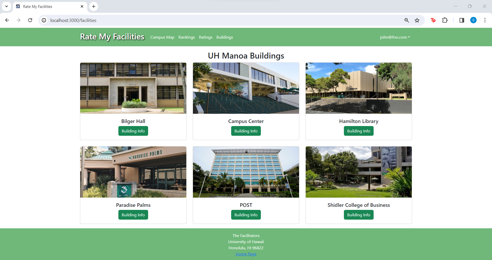

### Table of Contents
- <a href="goals">Overall Goals</a>
- <a href="progress">Milestone Progress</a>

<h2 id="goals">Overall Goals:</h2>
- Create initial landing, onboarding, signup page mockups
- Create initial layout of data collections
- Initial brand design - logo, color palette, branding

<a href="https://github.com/orgs/d-facilitators/projects/1">Our M1 Project Board</a>

<h2 id="progress">Milestone Progress:</h2>

### Sign Up Page

The sign up page allows a new user to create an account so that they have access to other pages.

### User Homepage

The home page contains access to other pages like the Campus Map and Ranking page.

### Facility Ranking

Once the user is logged in, they are able to access all ratings and view the top rated facilities. 

### Individual Facilities

This page displays individual facilities, where the user is able to rate them. Users can also view and upload images and comments as well as report any issues.

### Building List

Logged users can view a list of UH Manoa buildings with information on how many facilities they have, such as number of restrooms and water filters.
