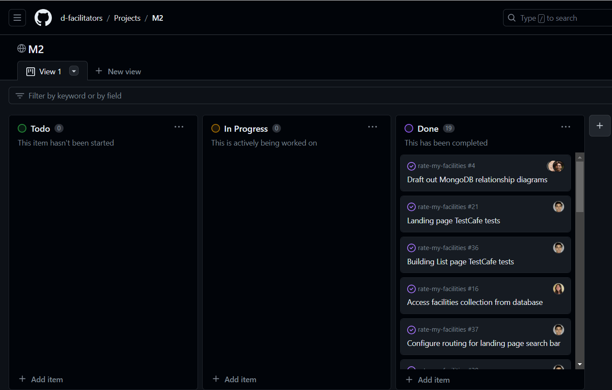
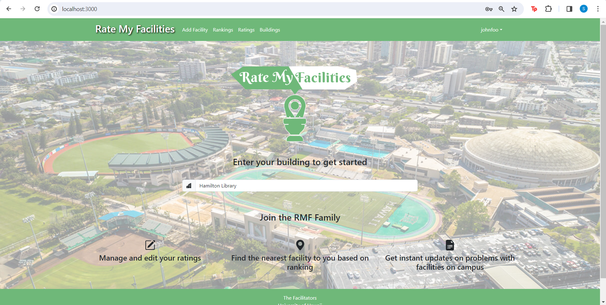

### Table of Contents
- <a href="goals">Overall Goals</a>

## Overall Goals
- Develop structure of data collections and relationships between collections
- Add simple functionality to existing pages
- Implement testing using TestCafe
- Continue creating mockup pages

<a href="https://github.com/orgs/d-facilitators/projects/2">Our M2 Project Board</a>

<h2 id="progress">Milestone Progress:</h2>

### User Homepage

Logged user can now find a building by looking it up on the search bar.

### Add Review Page

Logged user is now able to submit a review for a facility.

### Add a Facility Page

Logged in user is now able to add a new facility by entering the facility type, building name, and floor.