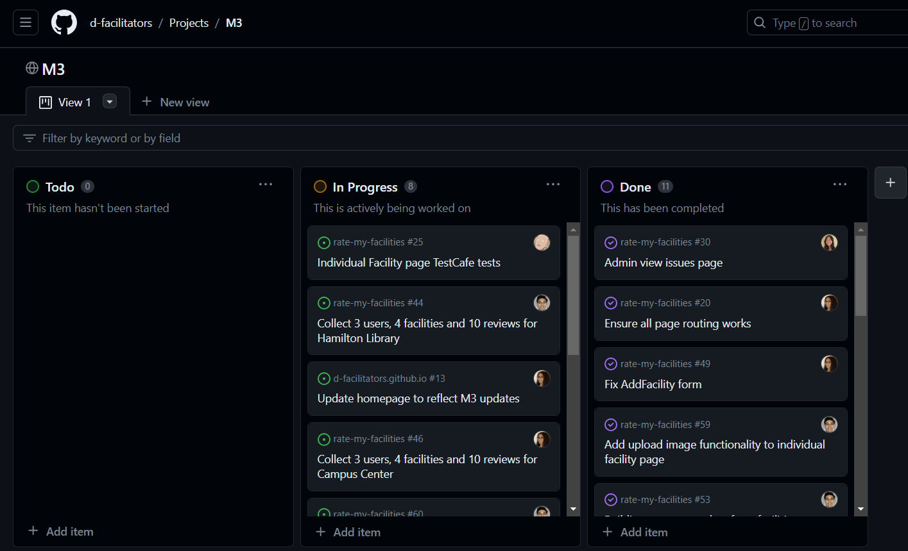

### Table of Contents
- <a href="goals">Overall Goals</a>

## Overall Goals
- Implement functionality of data collections
- Add functionality to mockup pages
- Continue adding pages and features
- Finalize project structure and routing between pages

<a href="https://github.com/orgs/d-facilitators/projects/4">Our M3 Project Board</a>

<h2 id="progress">Milestone Progress:</h2>

//TODO

### Status Updates (Admin)

Admins can view and update current usability status for all facilities. They can "Resolve" a facility that no longer has a standing issue and can also escalate an issue report into a standing issue.